# Posibilitati Examen
 
 

## 1. Masini Turing. Variante

- ### **redactare**
    1. definitii
        - a) TM det
            - mentioneaza semnificatia fiecare simbol
            - restrictii (e.g. cardinal)
            - configuratie
        - b) TM det cu mai multe benzi
        - c) TM nedet

    2. MT ca disp de acceptare/calc de functii
    3. enunturile care le leaga
    4. cele 2 demonstratii
        - specifica *scopul* **inainte** de dem

- ### **scopul**
    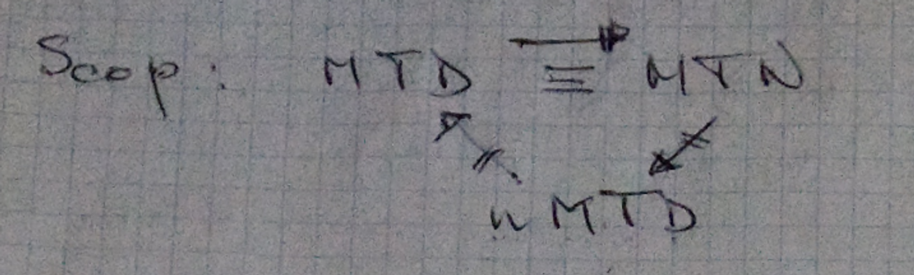
    1. definitia MT det/nedet/cu mai multe benzi
        - a) det - *C2, pag 2*
        - b) nedet
            - definitie formala
            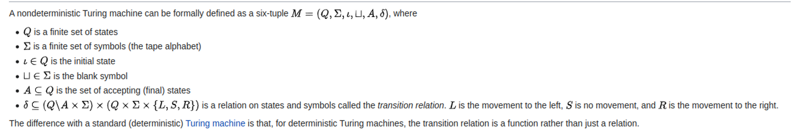
            - [*The difference with …*], ceea ce inseamna ca o NTM defineste un *computation tree*, compuse din alegeri pe care mT le face. fiecare nod a carui stare este *accept* sau *reject* este o frunza. o NTM respinge daca nicio ramura a arborelui nu sfarseste in *accept* state. o NTM accepta o intrare daca macar o ramura din tot arborele a dus la macar o stare de *accept.*
            [sursa.](https://jeffe.cs.illinois.edu/teaching/algorithms/models/09-nondeterminism.pdf)
        - c) cu mai multe benzi - *C2, pag 3*
    2. enuntul rezultatelor care leaga variantele de mai sus (reducere de la una la alta)
    3. MT ca dispozitiv de acceptare/calc de functii (cum se foloseste; **fara demonstratii**) - *C2, pag 1-2*
    4. demonstratia fiecareia dintre cele 2 teoreme de mai sus
        - a) MTN -> nMTD - *C3, pag 1-3*
        - b) nMTD -> MTD - *C3, pag 3-5*
        - mentioneaza ca, prin cele de mai sus, s-a dem si *MTD = MTN*

---
 

## 2. Functii Turing calculabile / calc cu programe standard / recursive

- ### **redactare**
    1. def fn Turing calculabila
    2. def fn calc cu PS
        - def PS
    3. def fn recursive
        - compunere functionala
        - recurenta primitiva
        - minimizare nemarginita
    4. MT-FR
        - memo
        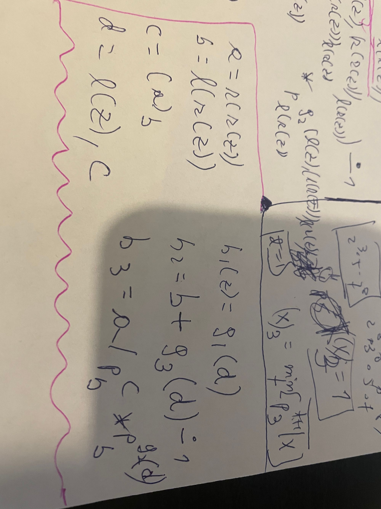
        - set-up: M, f, multimea de simboluri, multimea de stari, <a, <b, c>>
        - C\_M(x, n)
        - functiile h
        - functiile g
            - functiile h in functie de g
        - nr\_M(x)
        - f(x) = Lt(…)

        **SAU**
        FR -> PS
        - faci PS pt fiecare dintre: fn elementare (succ, proiectie, constante), comp functionala, recurenta primitiva si minimizare nemarginita
        PS -> MT
        - faci desenele la benzi
        - te folosesti de instructiuni(e.g. *V <- V, V <- V + 1,* etc.)

1. ce e o functie Turing (FT) calculabila - *C4, pag 1*
    - mai bine zis
    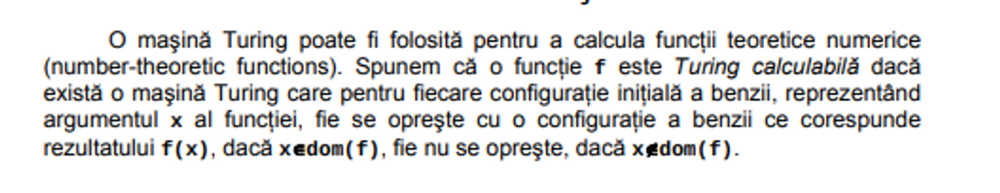
    [*pag 10*](http://swarm.cs.pub.ro/~alexj/facultate/aa/Calculabilitate.pdf)
2. ce e o functie calculabila cu program standard(PS) - *C4, pag 2-3*
3. ce e o functie recursiva - *C5, pag 1-3*
4. 3 teoreme care leaga cele 3 de mai sus (reducere) - **4p**
    - imagine sugestiva
    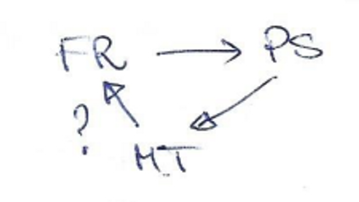
    1. de la Turing la recursiv (MT -> FR) - *C6, pag 22-39* - **4p**
        - greseala la Lt() corectata
        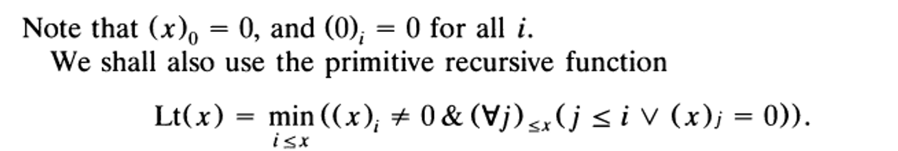
    ***sau***
    2. celelalte 2 teoreme - **2p fiecare**
        - a) FR -> PS (*C5, pag 1-3;* la fiecare proprietate a unei fn recursive se face si un program standard)
        - PS -> MT (*C4, pag 4-6*)

---
 

## 3. Multimi recursive / recursive numerabile /nerecursive

- ### **redactare**
    1. definitii
        - definitii mai usor de inteles
        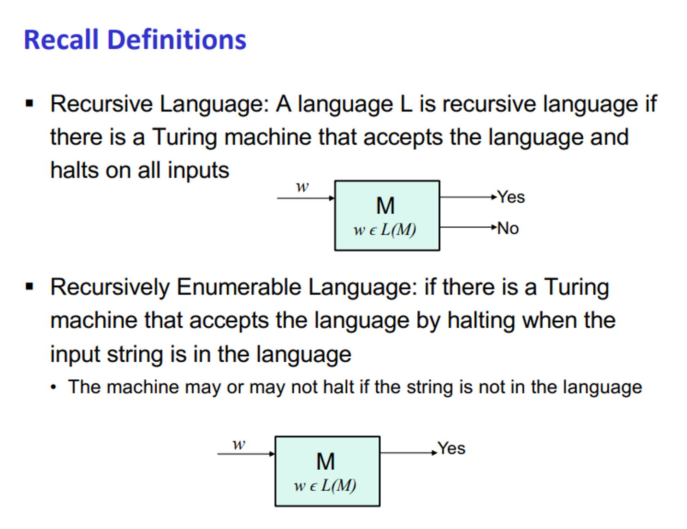
        cu alte cuv, pt un lbj recursiv este sigur faptul ca M coresp se va opri, indiferent de rezultat. in schimb, o mT M coresp unui lbj RE se opreste doar cand accepta un lbj, insa nu e sigur daca se opreste sau nu in cazul in care string ul nu e in lbj.
        1. recursive
        2. recursive enumerabile
    2. exemple de multimi care separa aceste clase + dem
        - dem L\_h(f asemanatoare cu cea pt L\_d)
        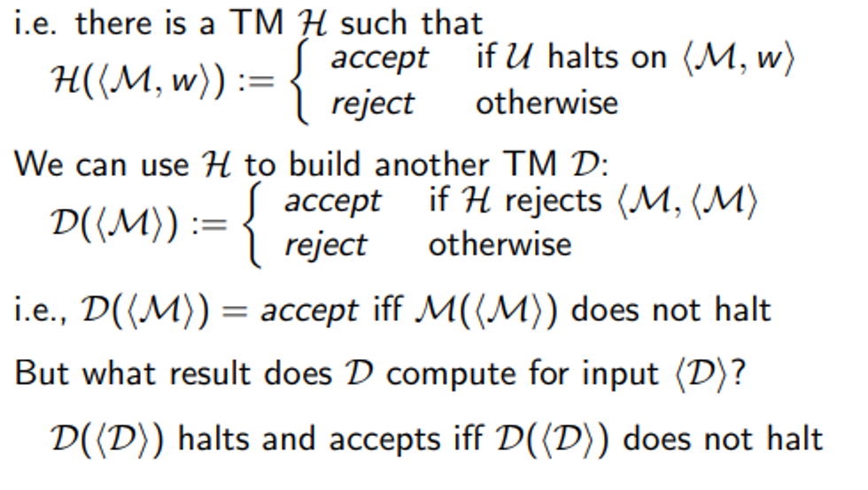
    3. proprietati (inchidere) + prop din wiki *+ [dem incepand de la slide 8](https://gw-cs3313-2021.github.io/lectures/TM6.pdf)*
        - cuv inainte de dem

            pt uniune si intersectie, o sa avem 2 masini Turing care vor rula in paralel. pt lbj rec, o sa fie nevoie ca ambele masini Turing sa se opreasca. pt lbj RE, o sa fie nevoie ca ambele masini sa accepte mai intai pentru a se opri
            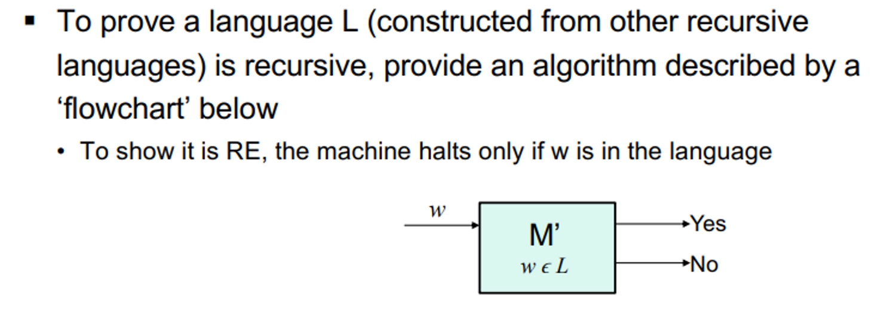
    4. enunt T Rice + dem

1. definitia fiecareia - *C7-8, pag 23-25*
2. exemple de multimi care separa aceste clase (**fara justificare**) *C7-8, pag 25*
3. proprietati (inchidere etc.) (**enunturi**) - *C7-8, pag 26*
    - [wiki article](https://en.wikipedia.org/wiki/Recursively_enumerable_language) (Closure Properties)
4. enuntul teoremei Rice (C7-8) + def proprietate netriviala - *C7-8, pag 28*
5. demonstratie Rice - *C7-8, pag 28*
6. demonstratia exemplelor care separa clasele - *C7-8, pag 25*
    - [dem pt ](http://www.cs.ox.ac.uk/people/paul.goldberg/CC/2018-19/slides3.pdf)[*L_h*](http://www.cs.ox.ac.uk/people/paul.goldberg/CC/2018-19/slides3.pdf) (slide 4*)*
7. prop de inchidere (demonstratie) - *C7-8, pag 26*
    - demonstratii se pot gasi [aici](https://gw-cs3313-2021.github.io/lectures/TM6.pdf)
    - intersectie
        
    - reuniune
        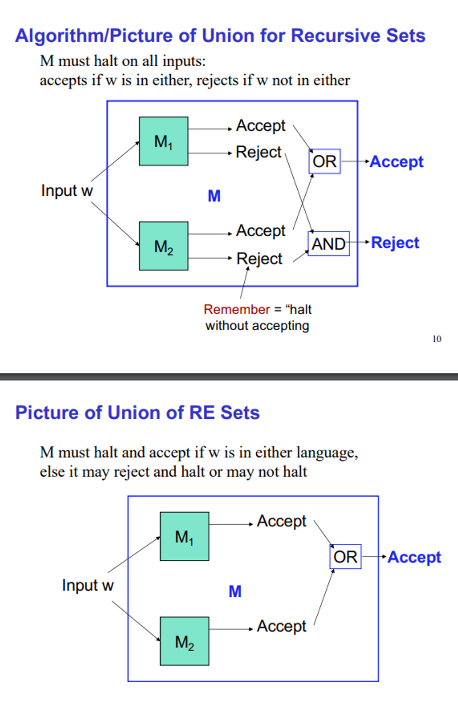
    - complement(pt lbj recursive)
        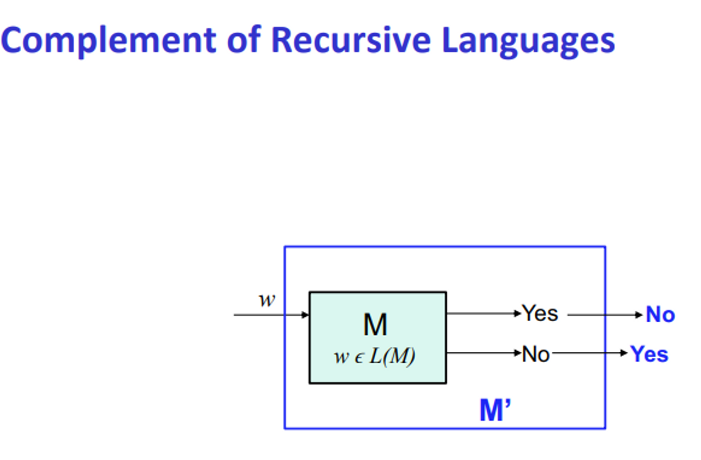

---
 

## 4. Programul universal. Problema opririi programelor

- ### **redactare**
    1. definitii
        - codificarea unui program: ET, VAR, INSTR + codificarea unui program
        - The Halting Problem: def + demonstratia ca lumea + dem din curs(cu PS)
        - program universal: def + dem
    2. codificarea MT

1. definitii
    - a) problema opririi programelor(*The Halting Problem*)
        - definitie
            nu există o maşină Turing, care primind la intrare descrierea unei alte maşini Turing T şi un şir de date de intrare x, să poată spune dacă T se opreşte vreodată cînd primeşte pe x la intrare
    - b) codificarea unui program - *C7-8, pag 3-5*
    - c) program universal - *C7-8, pag 9*
2. codificare(fara demonstratii la func recursive, spre exemplu) - *C7-8, pag 19-21*
3. demonstratie program universal - *C7-8, pag 8-18* 
    - greseli din curs corectate
    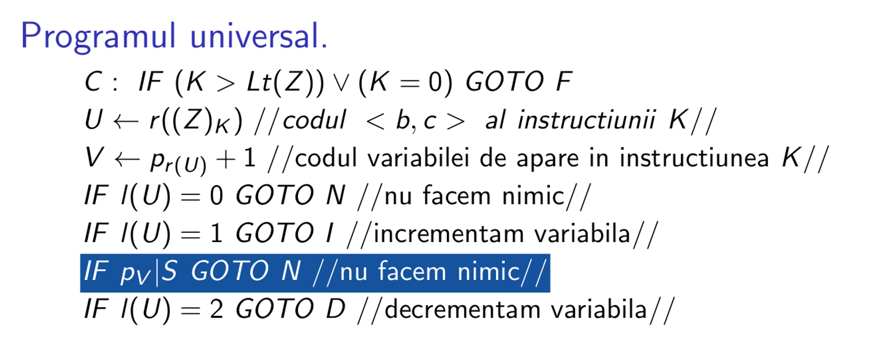
    ar trebui sa fie *(~(V | S))* si *+1* din *V* sa fie la indice:
    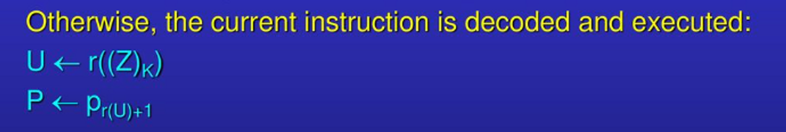
    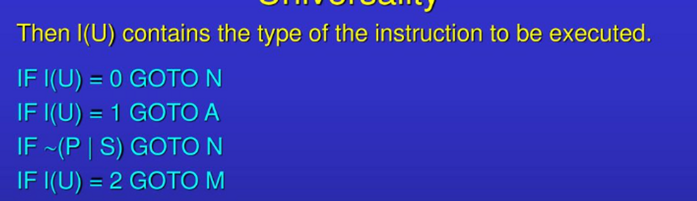
    [*sursa](https://slideplayer.com/slide/13370564/)*(slide 13-14)*
    la incrementare si decr, ar trb sa fie *V* in loc de *p\_v:*
    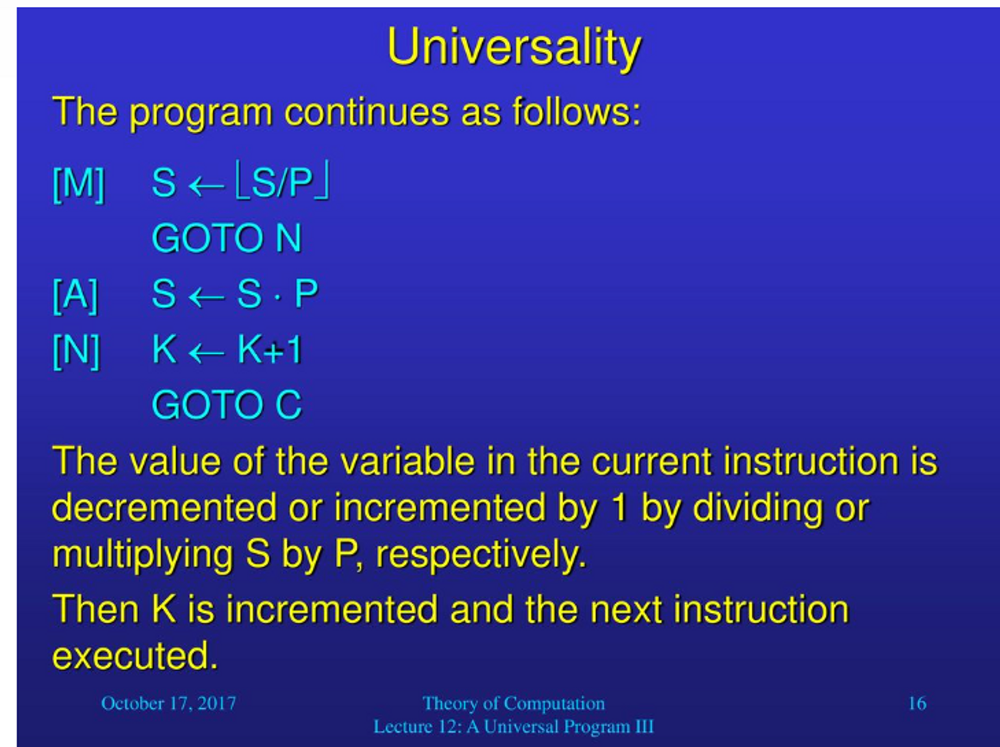
4. demonstratia ca problema opririi e nedecidabila - *C7-8, pag 7*
    - demonstratie (in curs se leaga doar de PS)
        *mult mai bine explicat [aici](https://www.cs.cmu.edu/~mihaib/articole/complex/complex-html.html), sectiunea Problema opririi (the halting problem)*

        Demonstraţia teoremei opririi este extrem de simplă, şi se face prin reducere la absurd. Demonstraţia este extrem de înrudită cu celebrul paradox al mincinosului, cunoscut de grecii antici, care spune că fraza "Eu mint" nu poate fi nici adevărată, nici falsă, pentru că în orice caz s-ar auto-contrazice.

        Să presupunem că există o maşină H, care rezolvă problema opririi. Atunci vom construi o nouă maşină, să-i spunem H1, care face următorul lucru:
        1. Primeşte la intrare o maşină M şi un şir x;
        2. Simulează funcţionarea lui H pe această intrare, pentru a vedea dacă M se opreşte atunci cînd primeşte pe x;
        3. Dacă H zice "da, M se opreşte", atunci H1 intră într-o buclă infinită;
        4. Dacă H zice "nu", atunci H1 se opreşte imediat.

        Din moment ce H1 este o maşină Turing, putem să o descriem şi pe ea însuşi folosind un şir de caractere. Ce se întîmplă însă dacă pornim maşina H1 avînd pe banda de la intrare chiar propria ei descriere, de două ori, o dată pe post de M şi o data pe post de x?

        Ei bine, dacă H1 se opreşte cu această intrare, atunci înseamnă că H1 va executa pasul (3) de mai sus, deci intră într-o buclă infinită, contradicţie!
        Dacă H1 nu se opreşte niciodată, atunci H1 va executa pasul (4), deci se va opri imediat, altă contradicţie!

        Aceste comportări sunt aberante, deci presupunerea noastră că H1 există trebuie să fie falsă; dar H1 este construită folosind H şi cîteva piese banale, deci H nu există!

---
 

## 5. Clasa de complexitate timp**

- **teorie**
    - det TM:

        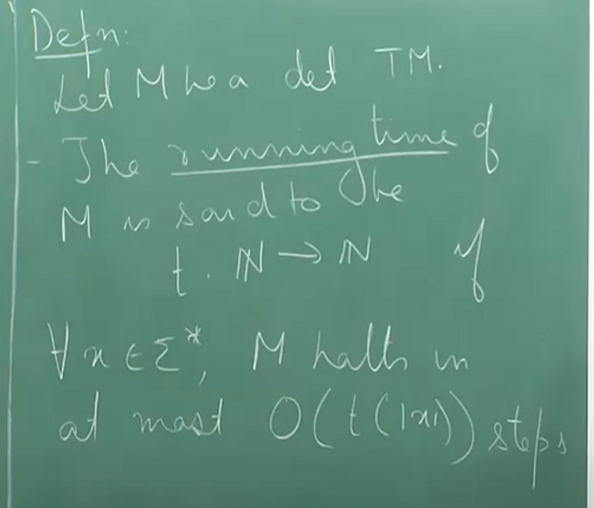
        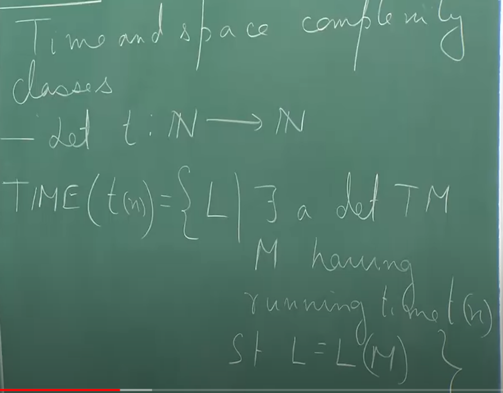

    - non-det TM:

        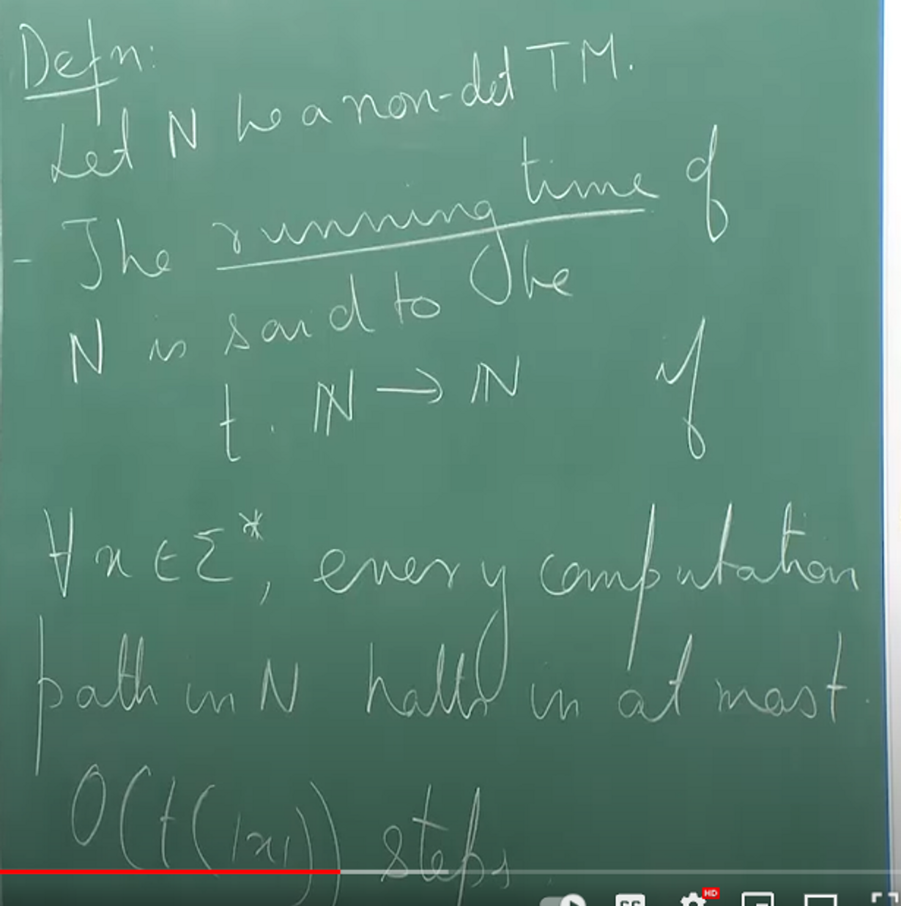
        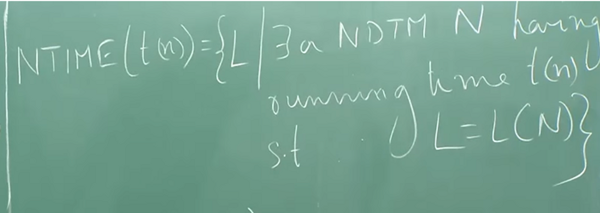

    - P si NP:

        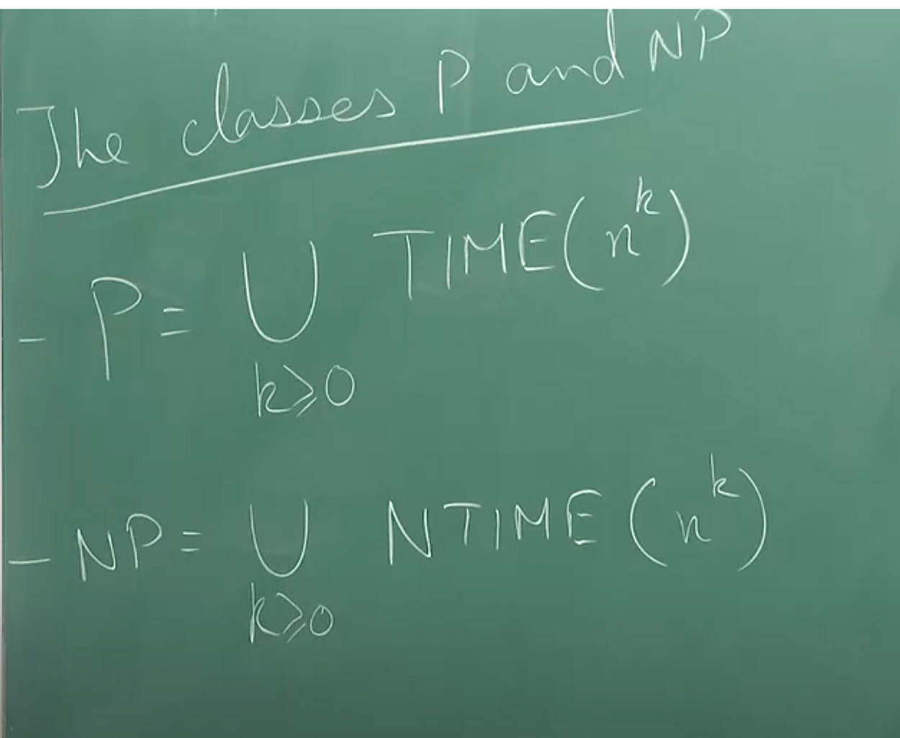
        
    - NP: solutia in sine poate fi determinata intr un timp mai ineficient, insa solutia poate fi **verificata in timp polinomial**

1. modelul de MT pt care se calculeaza masura de complexitate timp - *C9, pag 1*
2. definitia masurii de complexitate timp - *C9, pag 1*
    - raspuns
    
3. definitia clasei de complexitate timp - *C9, pag 1-2*
    - raspuns - **time**
    
    - coNP
    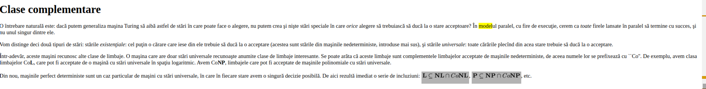
    [*sursa*](https://www.cs.cmu.edu/~mihaib/articole/complex/complex-html.html)
4. eliminarea constantelor (**enunt**) (1) - *C10, pag 1-3*
5. comprimarea benzilor (**enunt**) (2) - *C10, pag 4*
6. ierarhii de clase de complexitate (**enunt**) (3) - *C11, pag 3-5 (**time**)*
    - def TCC - *C11, pag 2*
7. legatura dintre timpul det-nedet (**enunt**) (4) - *C11, pag 6-7*
8. fiecare dintre cele 4 teoreme de mai sus - **dem**

---
 

## 6. Clase de complexitate spatiu

*exact ca la timp*
- **teorie**
    - det TM:
    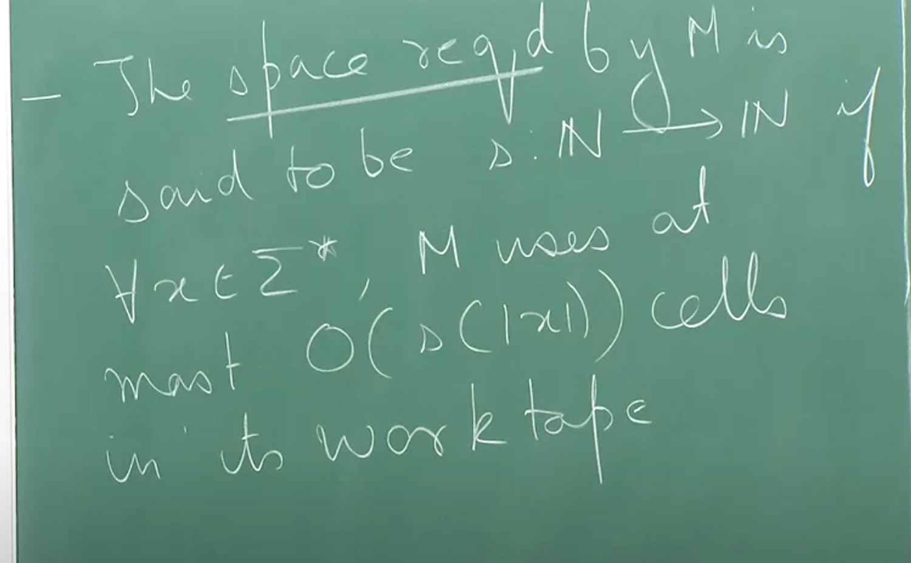
    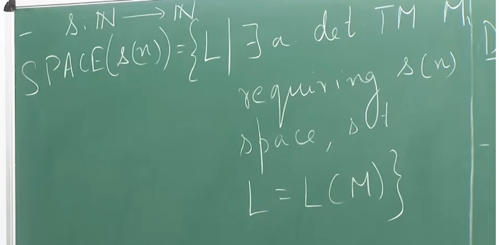
    - non-det TM:
    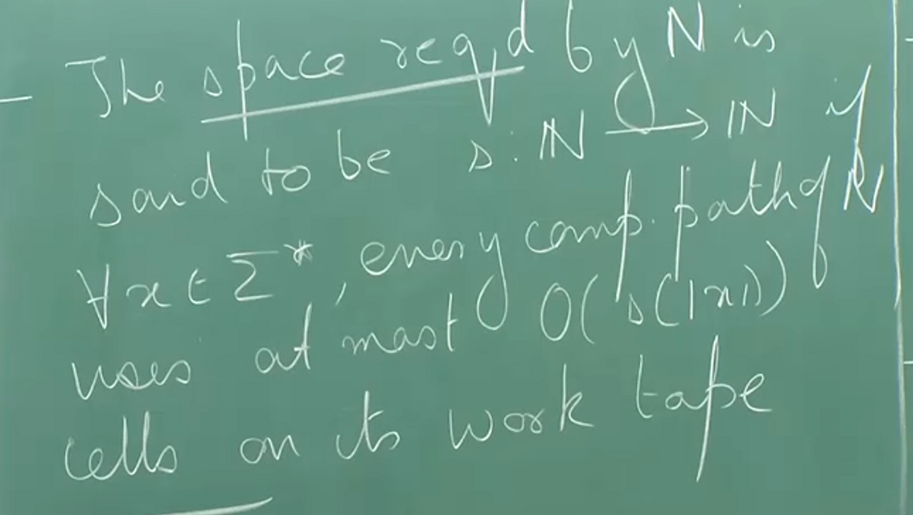
    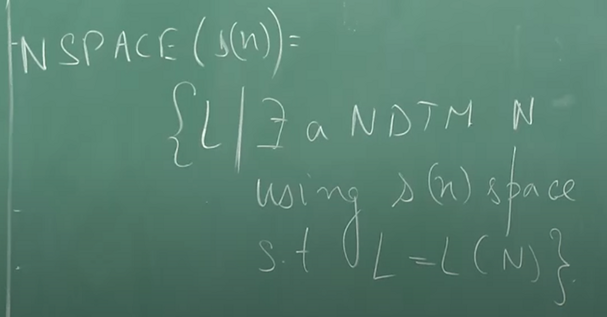
1. modelul de MT pt care se calculeaza masura de complexitate timp - *C9, pag 1 (la final)*
2. definitia masurii de complexitate spatiu
    - raspuns
    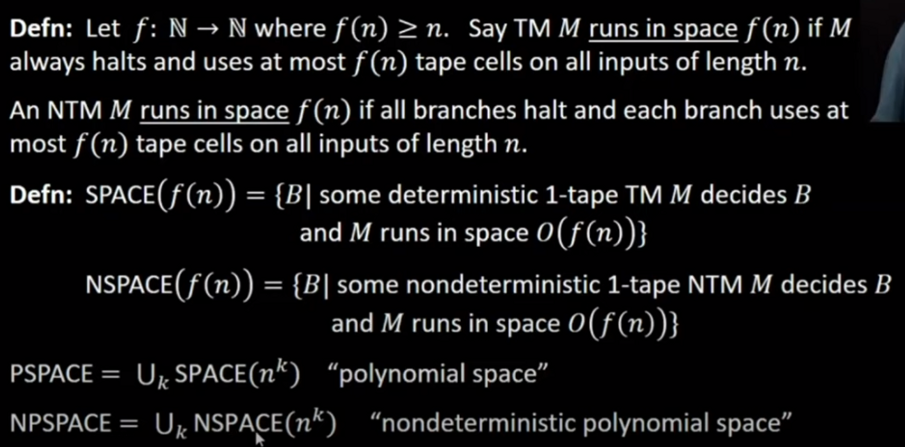
3. definitia clasei de complexitate spatiu
    - raspuns - **space**
    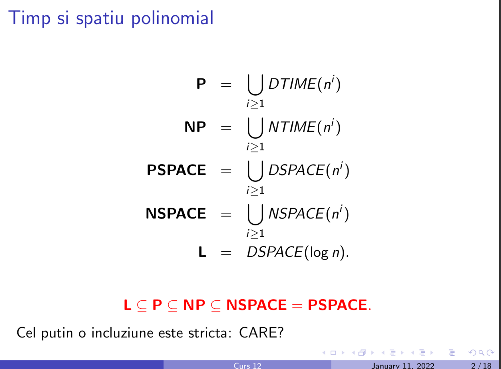
4. eliminarea constantelor (**enunt**) (1) - *C9, pag 2* 
5. comprimarea benzilor (**enunt**) (2)
    - dem din carte
    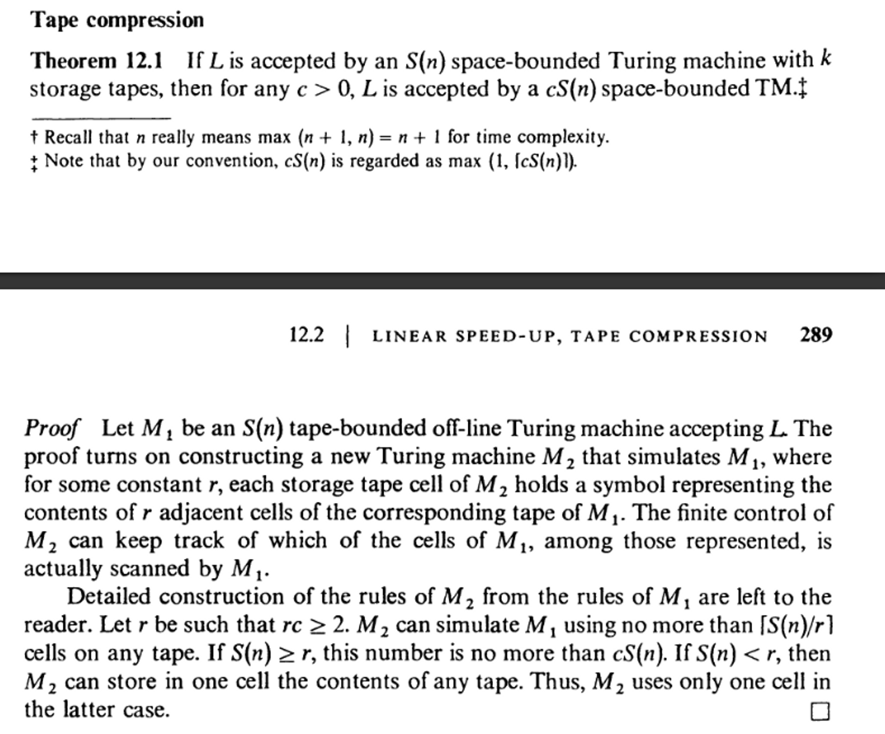
6. ierarhii de clase de complexitate(**enunt**) (3) - *C11, pag 3-5 (**space**)*
7. legatura dintre timpul det-nedet - *C11, pag 8-10*
8. fiecare dintre cele 4 teoreme de mai sus - **dem**

---
 

## 7. Reduceri si NP-completitudine

1. def reducere in timp polinomial (1) - *C12, pag 3*
2. def reducere in spatiu logaritmic (2) - *C12, pag 3*
3. def problemei (3) - *C12, pag 6*
    - completa pt o clasa in raport cu o reducere
    - dificila pt o clasa in raport cu o reducere
4. proprietatile reducerilor - *C12, pag 4-5*
5. o dem dintre cele 3 enunturi de mai sus
6. o pb NP-completa(de la curs sau nu) - *C12, pag 13-15*
    - dem pt Vertex Cover pb
    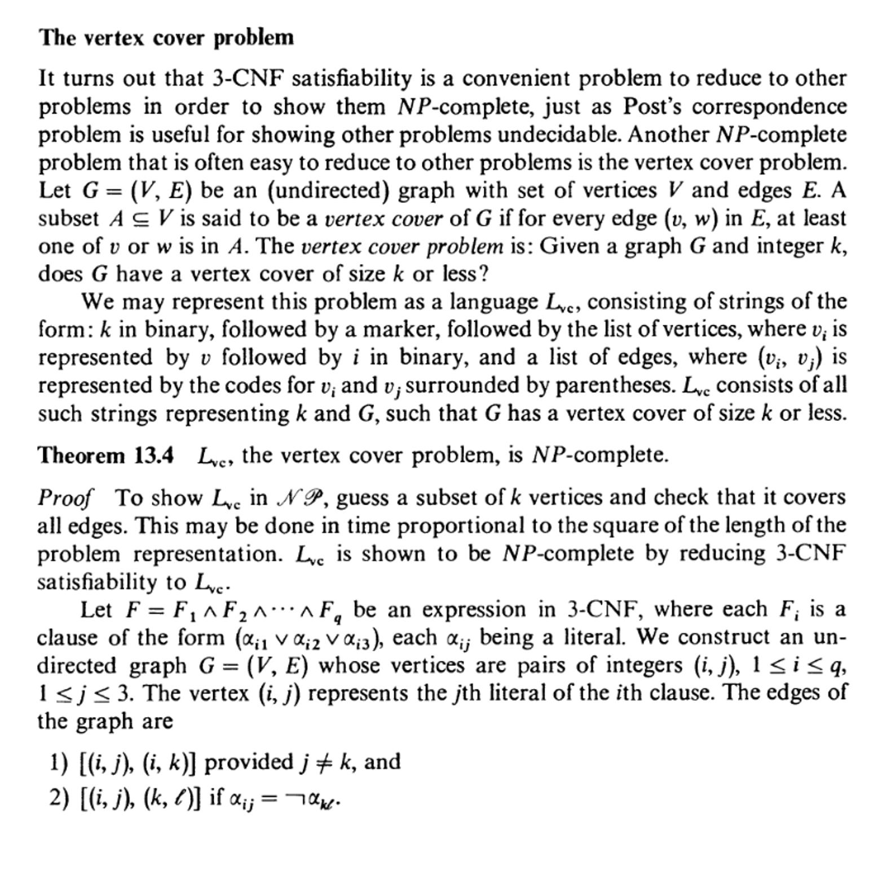
    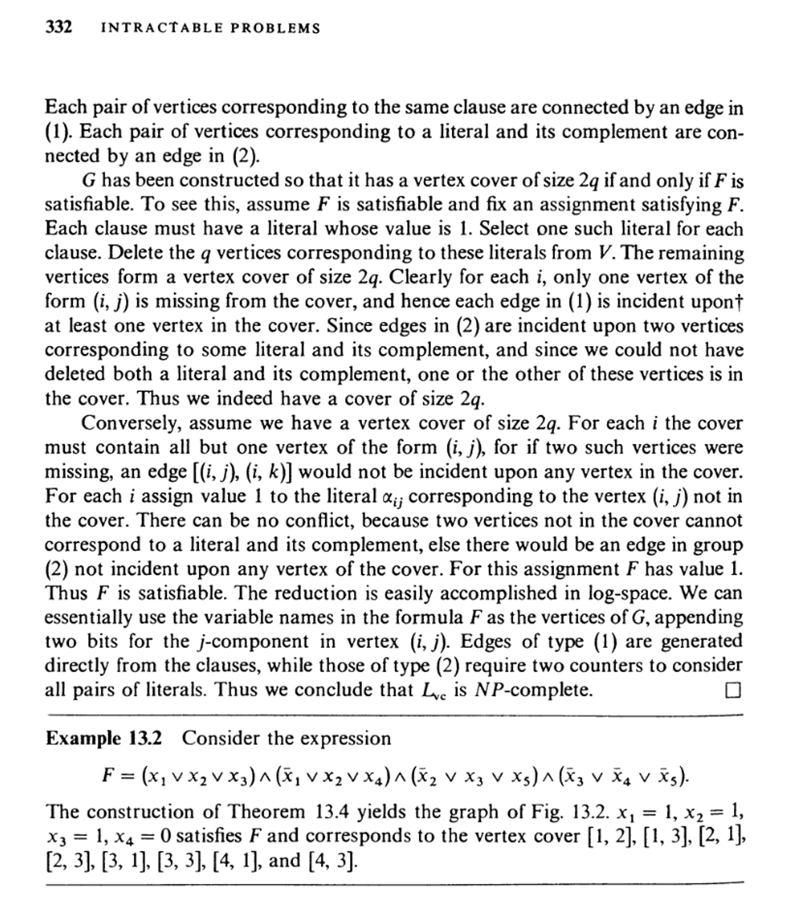
    1. arat ca e in clasa NP - *dem de mai sus*
    2. arat ca o pb cunoscuta NP-completa se poate reduce la ea - *dem de mai sus*
    3. dem ca aceasta reducere e posibila - *dem de mai sus*
    4. codificarea problemei - *C12, pag 14*